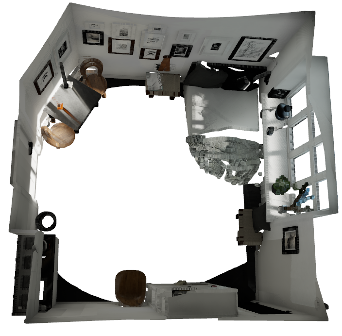
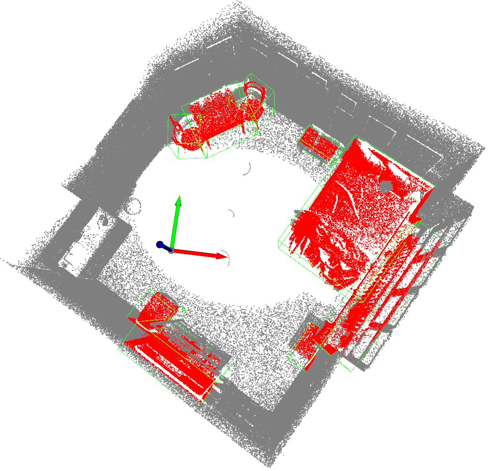

# Benchbot Semantic VSLAM 

This repository contains our submission for the **Robotic Vision Scene Understanding Challenge 2023**,
as part of the *Computer Vision 2 course* at the *University of Amsterdam*. Vision-based scene understanding
is a common task in the fields of robotics and computer vision in which visual systems attempt to
understand their environment, both from a semantic and geometric perspective.

The core of our method is the creation of a 3D point cloud map of a simulated environment with the
use of fast global registration. The semantic map is then created using a pre-trained 3D object detection
model that assigns bounding boxes around objects in the original 3D map. The results indicate that, while
very accurate in terms of predicting the label of an object, our method is not robust regarding 
other aspects important to the resulting map, such as the number of objects detected and their 
spatial quality. Our pipeline is impaired by components related to the estimation of coordinate 
transformations and limitations of the fast global registration method.






The figures show a 3D reconstruction of the "Miniroom" environment, as well as the 3D segmentation of the created point cloud.


## Installation

### Prerequisites

* [Benchbot](https://github.com/qcr/benchbot) software stack 
* pytorch 1.12
* cudatoolkit 10.2

### MMDetection3D

**Step 0.** Install [MMEngine](https://github.com/open-mmlab/mmengine), [MMCV](https://github.com/open-mmlab/mmcv) and [MMDetection](https://github.com/open-mmlab/mmdetection) using [MIM](https://github.com/open-mmlab/mim).

```shell
pip install -U openmim
mim install mmengine
mim install 'mmcv>=2.0.0rc4'
mim install 'mmdet>=3.0.0'
```

**Step 1.** Install MMDetection3D version included in this repository.

```shell
cd mmdetection3d
pip install -v -e .
```

## Set-up

**Step 1.** Load the simulation environment and the robot.

```shell
benchbot_run --robot carter_omni --env miniroom:1 --task semantic_slam:active:ground_truth -f
```

**Step 2.** Run the semantic SLAM pipeline.

* Note: should be run from the 'src' directory. 

```shell
benchbot_submit --native python3 solution/live_custom.py
```

The robot will now follow a set of waypoints and build a semantic map of the environment. The results of the pipeline will be saved in the 'result.json' file.

**Step 3.** Evaluate the results.

```shell
benchbot_eval --method omq result.json
```
